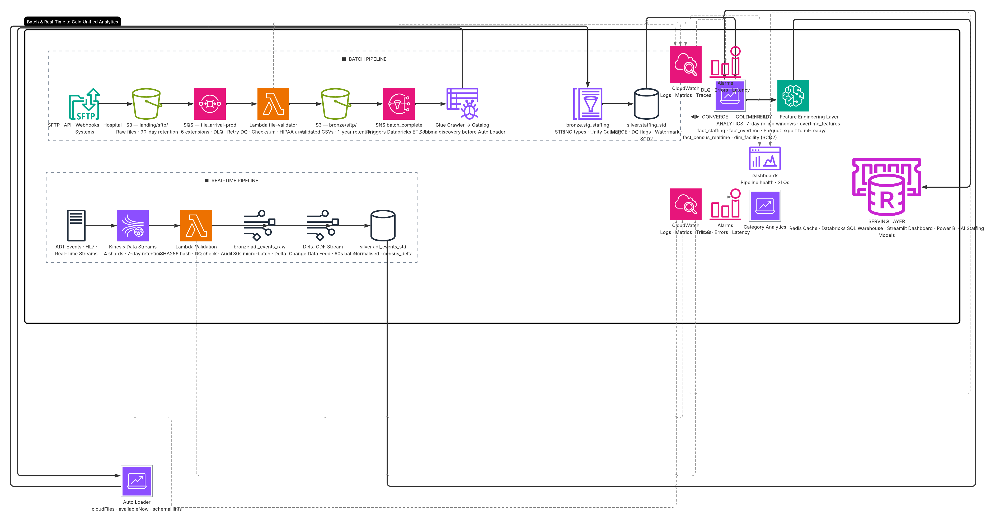

# Healthcare Staffing Analytics — v2
## Databricks Lakehouse + Streamlit + Terraform

A cloud-native healthcare staffing analytics platform built on AWS and the Databricks Lakehouse. The platform centralizes operational staffing data from multi-facility hospital networks, supporting batch and real-time ingestion, automated data-quality governance, predictive workforce analytics, and executive reporting — all within a governed Medallion architecture on Delta Lake.


---

## Healthcare Solution Architect

```

## Healthcare Solution Architect

<p align="center">
  
</p>

*Figure 1: End-to-end Healthcare Staffing Analytics Platform architecture on AWS and Databricks.*

```


---

## Architecture Overview

```


Hospital Sources (SFTP / API / ADT / Webhooks)
                    │
                    ▼
               S3 Landing
                    │
                    ▼
             SQS File Queue
                    │
                    ▼
           AWS Glue Crawler
                    │
                    ▼
             Glue Catalog
                    │
                    ▼
      Databricks Auto Loader
                    │
                    ▼
         Bronze Delta Tables
                    │
                    ▼
         Silver Delta Tables
                    │
                    ▼
          Gold Delta Tables
                    │
      ┌─────────────┼─────────────┐
      ▼             ▼             ▼
 ML-Ready      Databricks SQL   Redis Cache
 Feature Layer    Dashboards
      │ ▲
      ▼ │
AI Staffing Models
      │
Dashboard Cache Layer
      │
      ▼
Streamlit / Power BI / Executive Reporting

Real-Time Path
───────────────────────────────────────────

ADT Events
     │
     ▼
Kinesis Data Streams
     │
     ▼
Lambda Validation
     │
     ▼
Databricks Structured Streaming
     │
     ▼
Delta Bronze Tables

State / Logs

Operational Metadata Layer
─────────────────────────────────────

DynamoDB
│
├── hc_pipeline_log
├── hc_file_ledger
├── hc_metadata_store
├── hc_dq_log
├── hc_job_checkpoint
└── hc_cache_manifest
```

## S3 Data Lake Architecture

Amazon S3 serves as the central storage layer for the healthcare analytics platform. All batch and real-time data is persisted in S3 before being processed by Databricks.

### S3 Bucket Structure

```text
s3://healthcare-data-platform/

├── landing/
│   ├── sftp/
│   ├── api/
│   └── adt/
│
├── bronze/
│
├── silver/
│
├── gold/
│
├── ml-ready/
│
├── quarantine/
│
├── audit/
│
└── checkpoints/
```

### Intelligent Tiering

S3 Intelligent Tiering automatically optimizes storage costs by moving infrequently accessed data to lower-cost storage tiers while maintaining immediate retrieval capabilities.

### Encryption

All objects are encrypted using AWS KMS customer-managed keys.

### Versioning

Bucket versioning is enabled to support accidental deletion recovery, audit requirements, and regulatory compliance.

### Lifecycle Management

* Landing Data → 90 Days
* Bronze Data → 1 Year
* Silver Data → 3 Years
* Gold Data → 7 Years
* Audit Data → 7 Years
* Quarantine Data → 180 Days


## Event-Driven File Ingestion

Amazon SQS decouples file arrival from downstream processing.

### File Arrival Workflow

```text
Hospital Source
        │
        ▼
Landing S3
        │
        ▼
S3 Event Notification
        │
        ▼
SQS File Arrival Queue
        │
        ▼
Glue Workflow Trigger
        │
        ▼
Databricks Auto Loader
```

### Benefits

* Fault tolerance
* Decoupled processing
* Retry capability
* Horizontal scalability
* Guaranteed event durability

### Quarantine Queue

Files that fail validation are routed to a dedicated quarantine queue for remediation and investigation.

## AWS Glue Metadata Layer

AWS Glue serves as the metadata and governance layer for the platform.

### Glue Responsibilities

* Schema discovery
* Metadata catalog management
* Data classification
* Schema evolution tracking
* Data lineage support

### Glue Crawler Workflow

```text
Landing S3
      │
      ▼
Glue Crawler
      │
      ▼
Glue Catalog
      │
      ▼
Databricks Reads Metadata
```
## Real-Time Streaming Validation

AWS Lambda performs lightweight validation for real-time healthcare events before data enters the Lakehouse.

### Streaming Workflow

```text
ADT Events
      │
      ▼
Kinesis Data Streams
      │
      ▼
Lambda Validation
      │
      ▼
Databricks Structured Streaming
      │
      ▼
Bronze Delta Tables
```

### Validation Rules

Lambda validates:

* Required fields
* Message structure
* Timestamp formats
* Facility identifiers
* Event type classifications

### Failed Records

Invalid records are routed to:

* Quarantine S3
* SQS Quarantine Queue
* SNS Alert Notifications

This prevents malformed data from entering analytical workloads.

### Benefits

The Glue Catalog provides a centralized metadata repository that allows Databricks, Athena, and other AWS analytics services to share consistent schema definitions.


## DynamoDB Operational Metadata Layer

Amazon DynamoDB serves as the operational metadata and control-plane database for the healthcare analytics platform.

While Databricks stores analytical data, DynamoDB stores pipeline operational state, checkpoints, lineage, and monitoring information.

### DynamoDB Responsibilities

* File ingestion tracking
* Data quality logging
* Job checkpoint management
* Schema version tracking
* Pipeline audit history
* Cache registry management

### DynamoDB Tables

```text
hc_pipeline_log
hc_file_ledger
hc_metadata_store
hc_dq_log
hc_job_checkpoint
hc_cache_manifest
```

### Operational Workflow

```text
Hospital File
│
▼
S3 Landing
│
▼
File Checksum
│
▼
DynamoDB File Ledger
│
▼
Duplicate Detection
│
▼
Processing Approved
```

### Benefits

* Idempotent processing
* Duplicate file prevention
* Workflow checkpointing
* Near real-time metadata access
* Serverless scalability
* Operational audit traceability

## Redis Caching Layer

Amazon ElastiCache for Redis serves as the low-latency serving layer for dashboards, APIs, and operational metrics.

Databricks remains the system of record, while Redis provides sub-second access to frequently requested information.

### Redis Responsibilities

* Dashboard caching
* KPI acceleration
* Dimension lookup caching
* Real-time staffing metrics
* Executive scorecard acceleration

### Redis Workflow

```text
Databricks Gold
        │
        ▼
Dashboard Query
        │
        ▼
Redis Cache Check
        │
   ┌────┴────┐
   │         │
 Cache Hit   Cache Miss
   │         │
   ▼         ▼
Return KPI  Databricks Query
                 │
                 ▼
            Redis Refresh
```

### Cached Objects

* Facility benchmark summaries
* Daily staffing KPIs
* Overtime scorecards
* Workforce utilization metrics
* Data quality dashboards

### Benefits

* Sub-second dashboard performance
* Reduced Databricks SQL workload
* Lower compute costs
* Faster executive reporting
* Improved user experience


---

## Why Databricks over Snowflake and Redshift


| Capability                           | Redshift                          | Snowflake                      | Databricks                             |
| ------------------------------------ | --------------------------------- | ------------------------------ | -------------------------------------- |
| Compute / Storage Separation         | ⚠️ RA3 nodes only                 | ✅ Fully separated              | ✅ Fully separated                      |
| Batch Analytics                      | ✅                                 | ✅                              | ✅                                      |
| Real-Time Streaming                  | ⚠️ Limited                        | ⚠️ Snowpipe Streaming          | ✅ Native Structured Streaming          |
| Delta Lake Support                   | ❌                                 | ❌                              | ✅ Native                               |
| ACID Data Lake Transactions          | ❌                                 | ❌                              | ✅ Delta Lake                           |
| Time Travel                          | ❌ Manual snapshots                | ✅ Built-in                     | ✅ Delta Lake Time Travel               |
| Schema Evolution                     | ⚠️ Manual management              | ✅ Easy management              | ✅ Automatic with Delta                 |
| Machine Learning                     | ⚠️ SageMaker integration required | ⚠️ External ML tools           | ✅ Native MLflow Integration            |
| AI / LLM Workloads                   | ⚠️ External services              | ⚠️ External services           | ✅ Native AI & GenAI Support            |
| Feature Engineering                  | ❌                                 | ⚠️ Limited                     | ✅ Feature Store Support                |
| Workforce Forecasting Models         | ⚠️ External platform              | ⚠️ External platform           | ✅ Native ML Platform                   |
| Governance                           | ⚠️ IAM-centric                    | ✅ Strong RBAC                  | ✅ Unity Catalog                        |
| Medallion Architecture               | ⚠️ Custom implementation          | ⚠️ Custom implementation       | ✅ Native Design Pattern                |
| dbt Integration                      | ✅ Good                            | ✅ Excellent                    | ✅ Excellent                            |
| Streamlit Integration                | ⚠️ JDBC/ODBC                      | ✅ Native Connector             | ✅ SQL Warehouse Connector              |
| Auto Scaling Compute                 | ⚠️ Limited                        | ✅ Virtual Warehouses           | ✅ Cluster & Serverless Scaling         |
| Cost Efficiency (Large Data Volumes) | ⚠️ Good                           | ✅ Very Good                    | ✅ Excellent                            |
| Best Use Case                        | Traditional Data Warehouse        | Enterprise Analytics Warehouse | Data Engineering + Streaming + ML + AI |


For this healthcare staffing analytics platform, Databricks was selected as the primary analytical platform because the business requirements extend beyond traditional reporting and dashboarding. The platform must support near real-time staffing visibility, predictive overtime analysis, workforce forecasting, staffing shortage detection, and AI-driven staffing recommendations. Databricks provides a unified Lakehouse architecture combining data engineering, streaming, machine learning, AI, and analytics within a single platform, making it better aligned with the organization's long-term growth strategy than a traditional warehouse-centric architecture.

---


## Repository Structure

```text
healthcare_v2/
├── terraform/
│   ├── main.tf
│   ├── variables.tf
│   ├── providers.tf
│   ├── terraform.tfvars
│   ├── modules/
│   │   ├── databricks/            # Workspace, Unity Catalog, SQL Warehouses
│   │   ├── iam/                   # Glue, Lambda, Databricks access roles
│   │   ├── kinesis/               # Real-time streaming infrastructure
│   │   ├── sqs/                   # File arrival and quarantine queues
│   │   ├── sns/                   # Alerts and notifications
│   │   ├── dynamodb/              # Metadata, lineage, checkpoints, DQ logs
│   │   ├── elasticache/           # Redis caching layer
│   │   ├── glue/                  # Crawlers, Catalog, workflows
│   │   ├── s3/                    # Landing, Bronze, Silver, Gold, ML-ready
│   │   ├── kms/                   # Encryption keys
│   │   └── networking/            # VPC, Subnets, Security Groups, NAT
│   │
│   └── environments/
│       ├── dev/
│       │   └── terraform.tfvars
│       └── prod/
│           └── terraform.tfvars
│
├── databricks/
│   ├── notebooks/
│   │
│   │   ├── bronze/
│   │   │   ├── bronze_sftp_ingestion.py
│   │   │   ├── bronze_api_ingestion.py
│   │   │   └── bronze_streaming_ingestion.py
│   │   │
│   │   ├── silver/
│   │   │   ├── silver_staffing_transform.py
│   │   │   ├── silver_patient_census.py
│   │   │   └── silver_data_quality.py
│   │   │
│   │   ├── gold/
│   │   │   ├── gold_staffing_kpis.py
│   │   │   ├── gold_facility_benchmark.py
│   │   │   ├── gold_overtime_metrics.py
│   │   │   └── gold_executive_summary.py
│   │   │
│   │   └── ml_ready/
│   │       ├── overtime_forecast_features.py
│   │       ├── staffing_shortage_features.py
│   │       └── workforce_planning_features.py
│   │
│   ├── workflows/
│   │   ├── bronze_to_silver.yml
│   │   ├── silver_to_gold.yml
│   │   ├── ml_feature_pipeline.yml
│   │   └── realtime_streaming.yml
│   │
│   ├── sql/
│   │   ├── executive_dashboard.sql
│   │   ├── staffing_benchmark.sql
│   │   ├── overtime_analysis.sql
│   │   └── workforce_planning.sql
│   │
│   ├── dashboards/
│   │   ├── executive_dashboard.json
│   │   ├── operations_dashboard.json
│   │   └── data_quality_dashboard.json
│   │
│   └── unity_catalog/
│       ├── catalogs.sql
│       ├── schemas.sql
│       └── grants.sql
│
├── monitoring/
│   ├── cloudwatch/
│   │   ├── alarms.tf
│   │   └── dashboards.tf
│   │
│   ├── alerts/
│   │   ├── sns_notifications.py
│   │   ├── slack_notifications.py
│   │   └── email_notifications.py
│   │
│   └── data_quality/
│       ├── dq_rules.yml
│       ├── dq_monitoring.py
│       └── dq_scorecards.py
│
├── streamlit/
│   ├── app.py
│   ├── requirements.txt
│   │
│   ├── pages/
│   │   ├── executive_summary.py
│   │   ├── facility_benchmarking.py
│   │   ├── overtime_analysis.py
│   │   ├── staffing_shortage_detection.py
│   │   ├── workforce_planning.py
│   │   └── data_quality_dashboard.py
│   │
│   └── .streamlit/
│       └── secrets.toml.example
│
├── docs/
│   ├── architecture/
│   │   ├── solution_architecture.md
│   │   ├── data_flow.md
│   │   └── disaster_recovery.md
│   │
│   ├── operations/
│   │   ├── deployment_runbook.md
│   │   ├── monitoring_runbook.md
│   │   └── incident_response.md
│   │
│   └── business_requirements/
│       ├── staffing_analytics_requirements.md
│       └── executive_kpis.md
│
└── README.md
```


---

## Deployment Runbook

### 1. Prerequisites

```bash
# Install tooling
brew install terraform awscli databricks

# Python packages
pip install databricks-sdk
pip install databricks-sql-connector
pip install streamlit
pip install mlflow

# Configure AWS credentials
aws configure --profile healthcare-prod

# Configure Databricks CLI
databricks configure --host https://<workspace-url>

# Verify connectivity
databricks current-user me
```

### 2. Terraform — Infrastructure

```bash
cd terraform/

# Initialize Terraform
terraform init \
  -backend-config="bucket=healthcare-tfstate-prod" \
  -backend-config="dynamodb_table=healthcare-tflock"

# Review deployment plan
terraform plan -var-file="environments/prod/terraform.tfvars"

# Deploy infrastructure
terraform apply -var-file="environments/prod/terraform.tfvars"

# Verify deployed resources
aws s3 ls
aws glue get-databases
aws dynamodb list-tables
aws elasticache describe-replication-groups
```

### 3. Databricks — Initial Workspace Setup

```bash
# Import notebooks
databricks workspace import-dir \
  databricks/notebooks \
  /Shared/healthcare

# Deploy workflows
databricks bundle deploy

# Validate cluster connectivity
databricks clusters list

# Validate Unity Catalog
databricks catalogs list
```

### 4. Databricks — Initial Data Processing

```bash
# Run Bronze ingestion
Bronze_Ingestion_Workflow

# Run Silver transformation
Silver_Transformation_Workflow

# Run Gold KPI generation
Gold_Analytics_Workflow

# Run ML feature generation
ML_Feature_Pipeline
```

### 5. Databricks — Daily Incremental Processing

```bash
Bronze Auto Loader
        ↓
Silver Incremental Merge
        ↓
Gold KPI Refresh
        ↓
ML Feature Refresh
        ↓
Dashboard Cache Refresh
```

Databricks Workflows orchestrate all incremental processing using Delta Lake transaction logs, ensuring only new or modified data is processed.


## Databricks Medallion Architecture

```text
Landing (S3)
    │
    ▼
Bronze Delta Tables
    │
    ▼
Silver Delta Tables
    │
    ▼
Gold Delta Tables
    │
    ├── Executive KPIs
    ├── Facility Benchmarking
    ├── Overtime Analytics
    ├── Staffing Utilization
    └── Workforce Planning
    │
    ▼
ML-Ready Feature Layer
```

### Bronze Layer

Stores raw healthcare operational data exactly as received from:

* SFTP feeds
* Hospital APIs
* ADT events
* Scheduling systems

### Silver Layer

Applies:

* Data quality validation
* Deduplication
* Schema standardization
* Timestamp normalization
* Facility mapping
* Workforce enrichment

### Gold Layer

Contains business-ready datasets:

* Staffing KPIs
* Facility performance metrics
* Overtime metrics
* Workforce utilization
* Executive reporting datasets

### ML-Ready Layer

Provides feature-engineered datasets for:

* Predictive overtime forecasting
* Staffing shortage detection
* Workforce planning optimization
* AI-driven staffing recommendations

## Databricks Unity Catalog Hierarchy

```text
healthcare_catalog
│
├── bronze
│   ├── staffing_raw
│   ├── patient_census_raw
│   └── adt_events_raw
│
├── silver
│   ├── staffing_standardized
│   ├── patient_census
│   ├── workforce_reference
│   └── data_quality_results
│
├── gold
│   ├── fact_staffing
│   ├── fact_overtime
│   ├── fact_facility_performance
│   ├── dim_facility
│   ├── dim_date
│   └── executive_summary
│
└── ml_ready
    ├── overtime_features
    ├── staffing_shortage_features
    └── workforce_planning_features
```

Unity Catalog Governance

```text
Healthcare_Admin
    Full platform administration

Healthcare_Data_Engineer
    Read/Write Bronze, Silver, Gold

Healthcare_Data_Analyst
    Read Gold and ML-Ready

Healthcare_Executive
    Dashboard-only access

Healthcare_Auditor
    Read-only compliance access
```

### 6. Streamlit — Local Development

```bash
cd streamlit/
pip install -r requirements.txt

# Copy and fill in credentials
cp .streamlit/secrets.toml.example .streamlit/secrets.toml

streamlit run app.py
```

### 7. Streamlit — Production (ECS Fargate recommended)

```bash
# Build Docker image
docker build -t healthcare-dashboard:latest .

# Push to ECR
aws ecr get-login-password | docker login --username AWS --password-stdin $ECR_URL
docker push $ECR_URL/healthcare-dashboard:latest

# Deploy to ECS (Terraform manages the ECS task + ALB)
terraform apply -target=module.ecs
```

---


## DynamoDB Tables (6)

| Table | Purpose | TTL |
|---|---|---|
| `hc_pipeline_log` | Every Glue/Lambda run — status, duration, record counts | 90 days |
| `hc_file_ledger` | File checksum idempotency | 365 days |
| `hc_metadata_store` | Schema versions, feature flags, DQ config | No TTL |
| `hc_dq_log` | Per-record DQ violations, queryable by facility/rule | 30 days |
| `hc_job_checkpoint` | Watermarks for incremental loads | No TTL |
| `hc_cache_manifest` | Registry of what's in Redis — aids cold-start recovery | Matches Redis TTL |

---

## Redis Cache TTLs

| Group | TTL | Invalidated by |
|---|---|---|
| `dim_facility` (key maps for Lambda) | 1 hr | DIM_FACILITY SCD2 update |
| `dim_nursing_role` | 24 hr | Seed reload |
| `facility_daily_summary` | 15 min | databricks run complete → SNS → warmer |
| `np_ratio_realtime` | 5 min | Kinesis batch write |
| `ot_summary_monthly` | 30 min | databricks run complete |
| `scorecard_quarterly` | 1 hr | databricks run complete |
| `dq_dashboard` | 10 min | Any quarantine SQS event |


| Service    | Responsibility         |
| ---------- | ---------------------- |
| S3         | Data Lake Storage      |
| SQS        | Event-driven ingestion |
| Glue       | Metadata & Catalog     |
| Kinesis    | Real-time ingestion    |
| Lambda     | Validation             |
| Databricks | Processing & Analytics |
| DynamoDB   | Operational metadata   |
| Redis      | Low-latency serving    |
| Streamlit  | Presentation           |
| SNS        | Alerting               |
| CloudWatch | Monitoring             |
# Healthcare_Analytics_Platform
