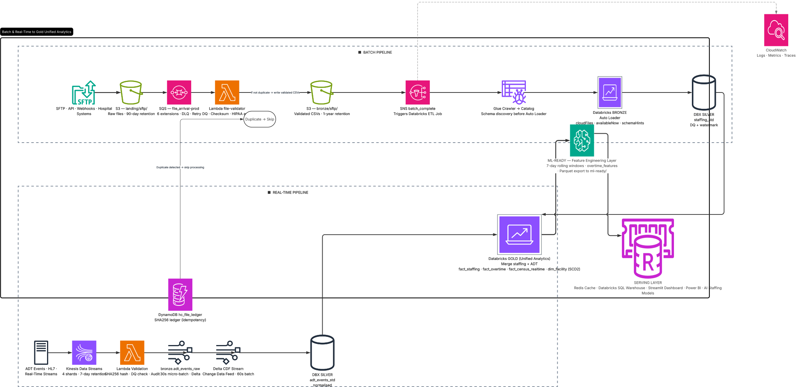
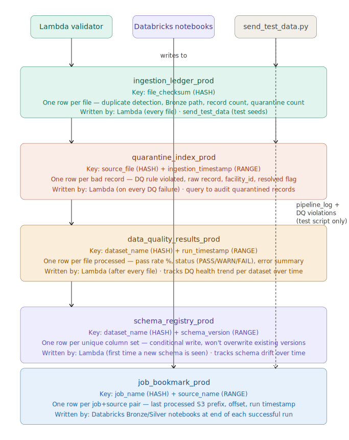

# Healthcare Staffing Analytics Platform

**AWS · Databricks Lakehouse · Terraform · Streamlit**

A cloud-native healthcare staffing analytics platform that centralises operational staffing data from multi-facility hospital networks. Supports batch and real-time ingestion, automated data-quality governance, predictive workforce analytics, and executive reporting — all within a governed Medallion architecture on Delta Lake.

---

## Table of Contents

1. [Architecture Overview](#architecture-overview)
2. [Data Flow](#data-flow)
3. [Infrastructure — AWS Services](#infrastructure--aws-services)
4. [Network Architecture — VPC & Security](#network-architecture--vpc--security)
5. [Data Pipeline — Batch Path](#data-pipeline--batch-path)
6. [Data Pipeline — Real-Time Path](#data-pipeline--real-time-path)
7. [Lambda File Validator & DQ](#lambda-file-validator--dq)
8. [Quarantine Process](#quarantine-process)
9. [DynamoDB Operational Tables](#dynamodb-operational-tables)
10. [AWS Glue — Schema Catalog](#aws-glue--schema-catalog)
11. [Databricks Workflows](#databricks-workflows)
12. [SNS Alerts & CloudWatch Monitoring](#sns-alerts--cloudwatch-monitoring)
13. [Redis Caching Layer](#redis-caching-layer)
14. [Streamlit Dashboard](#streamlit-dashboard)
15. [Databricks Medallion Architecture](#databricks-medallion-architecture)
16. [Unity Catalog Hierarchy](#unity-catalog-hierarchy)
17. [Repository Structure](#repository-structure)
18. [Quick Start — Running the Pipeline](#quick-start--running-the-pipeline)
19. [Deployment](#deployment)
20. [Why Databricks](#why-databricks)

---

## Architecture Overview

<p align="center">
  
</p>

*Figure 1: End-to-end Healthcare Staffing Analytics Platform on AWS and Databricks.*

<p align="center">
  
</p>

*Figure 2: Batch & Real-Time pipeline flows converging at Gold Unified Analytics.*

---

## Data Flow

```
Hospital Systems (SFTP / API / ADT)
          │
    ┌─────┴──────────────────────────┐
    │ Batch Path                     │ Real-Time Path
    ▼                                ▼
S3 landing/sftp/              Kinesis rt-events-prod
    │                                │
    ▼                                ▼
SQS file_arrival-prod         Lambda ESM (100 rec/batch)
    │                                │
    ▼                                ▼
Lambda file_validator ←──────────────┘
    │  DQ checks · checksum · HIPAA audit
    ├── valid records ──► S3 bronze/sftp/
    └── bad records  ──► SQS quarantine.fifo
                          └► quarantine_index DynamoDB
          │
          ▼
    SNS batch_complete
          │
    Lambda databricks-trigger
          │
    ┌─────┴──────────────────────────────────┐
    │         Databricks ETL Job              │
    │  Glue Crawler → Bronze → Silver → Gold → ML
    └─────────────────────────────────────────┘
          │
    Serving Layer
    Redis · Databricks SQL · Streamlit · Power BI
```

---

## Infrastructure — AWS Services

| Service | Resource | Purpose |
|---|---|---|
| S3 | `hc-data-lake-prod` | Landing, Bronze, Silver, Gold, ML-ready, audit, quarantine, checkpoints |
| SQS | `file_arrival-prod` (standard) | S3 → Lambda trigger for batch CSV files |
| SQS | `quarantine-prod.fifo` (FIFO) | Bad records held for manual remediation |
| SQS | `kinesis_dlq-prod` (standard) | Kinesis Lambda failure destination |
| SQS | `file_arrival-dlq-prod` | Dead-letter queue for file_arrival processing failures |
| Kinesis | `rt-events-prod` | 4 shards · 168-hour retention · real-time ADT events |
| Lambda | `file-validator-prod` | DQ validation, Bronze write, DynamoDB writes, quarantine routing |
| Lambda | `databricks-trigger-prod` | Calls Databricks Jobs API on SNS batch_complete |
| Lambda | `redis-writer-prod` | Writes KPIs to ElastiCache after Gold run |
| SNS | `batch_complete-prod` | Fires when S3 bronze/ file written — triggers ETL job |
| SNS | `ops_alerts-prod` | Lambda errors, DQ failures, job failures → email alert |
| Glue Crawler | `bronze-crawler-prod` | Schema discovery for bronze/sftp/ every 30 min during shifts |
| Glue Catalog | `healthcare-data-platform_bronze_prod` | Metadata store for Auto Loader schema hints |
| DynamoDB | 6 tables | Pipeline operational metadata (see [DynamoDB section](#dynamodb-operational-tables)) |
| ElastiCache | Redis | Sub-second KPI serving for dashboards |
| KMS | `e258d5b9-...` | Customer-managed encryption key for all services |

### S3 Bucket Layout

```
s3://hc-data-lake-prod/
├── landing/sftp/          # Raw files from hospital SFTP feeds
├── bronze/sftp/           # Validated CSVs written by Lambda
├── bronze/realtime/       # Valid Kinesis ADT records
├── bronze/delta/          # Delta Lake tables (stg_staffing)
├── silver/                # Transformed, DQ-flagged, deduplicated
├── gold/                  # Business-ready fact and dim tables
├── ml-ready/              # Feature-engineered datasets
├── quarantine/            # Files that failed validation
├── audit/ingestion/       # HIPAA audit trail (one JSON per file)
├── checkpoints/           # Auto Loader and streaming checkpoints
└── unity-catalog/         # Databricks Unity Catalog metadata (never wipe)
```

### S3 Data Retention

| Layer | Retention |
|---|---|
| Landing | 90 days |
| Bronze | 1 year |
| Silver | 3 years |
| Gold | 7 years |
| Audit | 7 years |
| Quarantine | 180 days |


---

## Network Architecture — VPC & Security

<p align="center">
  
</p>

The platform runs inside a dedicated VPC with strict network isolation. All compute resources (Lambda, Glue, Redis) are in private subnets — no direct internet access. HIPAA requires this boundary to ensure PHI never traverses the public internet.

### VPC Layout

```
VPC: healthcare-data-platform-vpc-prod
CIDR: 10.0.0.0/16  |  vpc-0de5705591edb6087  |  us-east-1
│
├── PUBLIC SUBNETS (NAT Gateways only — no compute)
│   ├── 10.0.101.0/24  us-east-1a  →  NAT GW 0  (3.228.32.206)
│   ├── 10.0.102.0/24  us-east-1b  →  NAT GW 1  (44.207.227.88)
│   └── 10.0.103.0/24  us-east-1c  →  NAT GW 2  (54.205.60.209)
│
├── PRIVATE SUBNETS (all compute lives here)
│   ├── 10.0.1.0/24  us-east-1a  →  Lambda · Glue · Redis Primary
│   ├── 10.0.2.0/24  us-east-1b  →  Lambda · Glue · Redis Replica
│   └── 10.0.3.0/24  us-east-1c  →  Lambda · Glue · Redis Replica
│
└── INTERNET GATEWAY: igw-0627d9f33aa87bc94
```

### Traffic Flow

```
Private Subnet Resource (Lambda / Glue)
        │  needs to call AWS API (S3, DynamoDB, KMS, Kinesis)
        ▼
Route Table (private) → 0.0.0.0/0 → NAT Gateway (same AZ)
        │
        ▼
NAT Gateway (public subnet) → Internet Gateway → AWS Public Endpoint
        │
        ▼  response returns same path
Lambda / Glue receives API response

INBOUND: Nothing from internet can reach private subnet resources.
         No inbound rules on Lambda. Redis only reachable from sg-lambda and sg-glue.
```

### Route Tables

| Route Table | ID | Default Route | Used By |
|---|---|---|---|
| `public-rt-prod` | `rtb-08ea03678852e1b62` | `→ IGW` | Public subnets (NAT GWs) |
| `private-rt-0-prod` | `rtb-004ca61990a4d7d49` | `→ NAT GW 0` | Private subnet us-east-1a |
| `private-rt-1-prod` | `rtb-090275665545c6b17` | `→ NAT GW 1` | Private subnet us-east-1b |
| `private-rt-2-prod` | `rtb-01eaed3b8c6cf77c8` | `→ NAT GW 2` | Private subnet us-east-1c |

Each private subnet routes to the NAT Gateway **in its own AZ**. If us-east-1a fails, us-east-1b and us-east-1c continue processing independently.

### Security Groups

| Security Group | ID | Inbound | Outbound | Attached To |
|---|---|---|---|---|
| `sg-lambda-prod` | `sg-0b4aab636968a0fc5` | None (event-driven) | 443 → internet · 6379 → sg-redis | Lambda functions |
| `sg-glue-prod` | `sg-0eca45369d1117cd8` | Self (worker coordination) | 443 → internet · Self | Glue crawler |
| `sg-redis-prod` | `sg-0ff7876ceda9f69b6` | 6379 ← sg-lambda · 6379 ← sg-glue | None needed | ElastiCache Redis |

**Zero-trust enforcement:** Redis (`sg-redis-prod`) only accepts connections from `sg-lambda-prod` and `sg-glue-prod`. No other VPC resource — not even another Lambda — can reach Redis without being in an allowed security group.

### NAT Gateways — Why Three?

| | One NAT Gateway | Three NAT Gateways ✅ |
|---|---|---|
| Cost | ~$33/month | ~$100/month |
| AZ failure impact | **All private subnets lose internet** | Only that AZ affected |
| HIPAA HA requirement | ❌ Single point of failure | ✅ AZ-independent |
| Production suitable | ❌ | ✅ |

Three NAT Gateways ensure an AZ-level outage never takes down the full pipeline. Lambda in us-east-1b routes through NAT GW 1 regardless of what happens in us-east-1a.

### Cost Optimisation — VPC Gateway Endpoints (Recommended Addition)

S3 and DynamoDB Gateway Endpoints are **free** and eliminate NAT Gateway data transfer charges for these two high-volume services:

```hcl
# Add to modules/network/main.tf
resource "aws_vpc_endpoint" "s3" {
  vpc_id            = aws_vpc.this.id
  service_name      = "com.amazonaws.us-east-1.s3"
  vpc_endpoint_type = "Gateway"
  route_table_ids   = [for rt in aws_route_table.private : rt.id]
}

resource "aws_vpc_endpoint" "dynamodb" {
  vpc_id            = aws_vpc.this.id
  service_name      = "com.amazonaws.us-east-1.dynamodb"
  vpc_endpoint_type = "Gateway"
  route_table_ids   = [for rt in aws_route_table.private : rt.id]
}
```

Lambda reads S3 on every file and writes to DynamoDB on every record — both bypass NAT Gateway with endpoints, reducing monthly costs by $200–500 at production scale.

---

## Data Pipeline — Batch Path

```
Hospital SFTP / API
        │
        ▼
S3 landing/sftp/<facility>/staff_<timestamp>.csv
        │  S3 ObjectCreated notification
        ▼
SQS file_arrival-prod (standard)
        │  Lambda event source mapping
        ▼
Lambda file-validator-prod
  ├── Checksum check against ingestion_ledger (duplicate prevention)
  ├── DQ rules: NULL_FACILITY_ID, CENSUS_OUT_OF_RANGE,
  │             OT_HOURS_EXCEED_MAX, NEGATIVE_STAFF_COUNT
  ├── Valid records → S3 bronze/sftp/
  ├── Bad records  → SQS quarantine.fifo + quarantine_index DynamoDB
  ├── Schema       → schema_registry DynamoDB (conditional write)
  ├── DQ summary   → data_quality_results DynamoDB
  ├── Ledger entry → ingestion_ledger DynamoDB
  └── Audit record → S3 audit/ingestion/<date>/<checksum>.json
        │
        ▼ S3 ObjectCreated on bronze/sftp/
SNS batch_complete-prod
        │
        ▼
Lambda databricks-trigger-prod
        │  Databricks Jobs API
        ▼
Healthcare ETL Pipeline (job 727296529764626)
  Step 1: Run_Glue_Crawler
  Step 2: Bronze_Ingestion_Workflow
  Step 3: Silver_Transformation_Workflow
  Step 4: Gold_Unified_Analytics
  Step 5: ML_Feature_Pipeline
```

---

## Data Pipeline — Real-Time Path

```
Hospital ADT Systems (ADMIT / DISCHARGE / TRANSFER)
        │
        ▼
Kinesis rt-events-prod (4 shards · 168-hr retention)
        │  Lambda Event Source Mapping (batch 100 records)
        ▼
Lambda file-validator-prod
  ├── Base64 decode Kinesis payload
  ├── DQ checks (same rules as batch)
  ├── Valid  → S3 bronze/realtime/<date>/<uuid>.json
  ├── Bad    → SQS quarantine.fifo + quarantine_index DynamoDB
  └── Audit  → S3 audit/realtime/<date>/<uuid>.json
        │
        ▼
Healthcare RT Streaming Pipeline (job 560379522229937)
  Runs every 5 minutes — cron(0 0/5 * * * ?)
  Step 1: ADT_Bronze_Streaming   → bronze.adt_events_raw
  Step 2: ADT_Silver_Streaming   → silver.adt_events_standardized
        │
        ▼
Gold_Unified_Analytics picks up silver.adt_events_standardized
  → gold.fact_census_realtime (admits/discharges per unit per hour)
```

---

## Lambda File Validator & DQ

The `file-validator-prod` Lambda is the single entry point for all record-level validation. It handles both S3 (SQS-triggered) and Kinesis (ESM-triggered) event sources.

### DQ Rules

| Rule | Trigger | Action |
|---|---|---|
| `NULL_FACILITY_ID` | `facility_id` is null or empty | Quarantine record |
| `CENSUS_OUT_OF_RANGE` | `patient_census` < 0 or > 1500 | Quarantine record |
| `OT_HOURS_EXCEED_MAX` | `hours_worked_overtime` > 24 | Quarantine record |
| `NEGATIVE_STAFF_COUNT` | `staff_count` < 0 | Quarantine record |
| `STAFF_COUNT_NOT_NUMERIC` | `staff_count` cannot be cast to int | Quarantine record |

### DynamoDB Writes (per file processed)

| Table | What is written | When |
|---|---|---|
| `ingestion_ledger_prod` | File checksum, bronze path, record counts | Every file |
| `quarantine_index_prod` | One row per bad record | DQ failure |
| `data_quality_results_prod` | Pass rate, error summary, status | Every file |
| `schema_registry_prod` | Column list + hash version | New schema only (conditional write) |

### Bad Data Detection Flow

<p align="center">
  
</p>

---

## Quarantine Process

### How it works

Bad records are quarantined at the record level — valid records in the same batch continue processing normally (partial batch support).

```
Bad record detected by Lambda
        │
        ├── SQS quarantine-prod.fifo
        │     FIFO · 14-day retention · manual drain
        │
        └── quarantine_index_prod (DynamoDB)
              source_file (HASH) + ingestion_timestamp (RANGE)
              quarantine_reason · facility_id · raw_record · resolved flag
```

### Remediation workflow

<p align="center">
  
</p>

**Step-by-step remediation:**

```bash
# 1. Review unresolved quarantine records
python tests/dynamo_ops_queries.py --query quarantine_unresolved

# 2. See which DQ rules are firing most
python tests/dynamo_ops_queries.py --query quarantine_by_rule

# 3. Inspect all bad records from a specific file
python tests/dynamo_ops_queries.py --query quarantine_by_file \
  --file "s3://hc-data-lake-prod/landing/sftp/test_hospital/staff_20260623.csv"

# 4. After fixing — re-upload to remediated/ prefix
aws s3 cp fixed_record.csv \
  s3://hc-data-lake-prod/landing/sftp/remediated/fixed_$(date +%s).csv

# 5. S3 notification fires automatically → Lambda reprocesses
# 6. Mark original quarantine record as resolved
python tests/dynamo_ops_queries.py --query quarantine_by_file \
  --file "s3://hc-data-lake-prod/landing/sftp/test_hospital/staff_20260623.csv"
```

> The quarantine FIFO queue is separate from the `file_arrival-dlq`. The DLQ only captures Lambda processing failures on the S3 notification path — it does not receive intentionally quarantined records.

---

## DynamoDB Operational Tables

<p align="center">
  
</p>

Six tables form the operational control plane — all written automatically by Lambda and Databricks notebooks.

| Table | Key | Writer | Purpose |
|---|---|---|---|
| `ingestion_ledger_prod` | `file_checksum` (HASH) | Lambda | Duplicate prevention · Bronze path · record counts |
| `quarantine_index_prod` | `source_file` (HASH) + `ingestion_timestamp` (RANGE) | Lambda | Per-record bad data audit · queryable without touching SQS |
| `data_quality_results_prod` | `dataset_name` (HASH) + `run_timestamp` (RANGE) | Lambda | DQ pass rate trend · error breakdown per file |
| `schema_registry_prod` | `dataset_name` (HASH) + `schema_version` (RANGE) | Lambda | Column schema versions · detects hospital format changes |
| `job_bookmark_prod` | `job_name` (HASH) + `source_name` (RANGE) | Databricks notebooks | Last processed offset per job · enables incremental runs |
| `pipeline_log_prod` | `pipeline_id` (HASH) + `event_timestamp` (RANGE) | Databricks notebooks | Job run history · duration · records processed |

### Operational Queries

```bash
# Daily health check — covers all 6 tables
python tests/dynamo_ops_queries.py --query all

# Did all Databricks jobs run today?
python tests/dynamo_ops_queries.py --query job_status

# DQ trend for sftp_staffing over 7 days
python tests/dynamo_ops_queries.py --query dq_trend --dataset sftp_staffing --days 7

# Files that had quarantined records
python tests/dynamo_ops_queries.py --query files_with_quarantine

# Most common DQ failure rules
python tests/dynamo_ops_queries.py --query quarantine_by_rule

# Did this file already get processed? (duplicate check)
python tests/dynamo_ops_queries.py --query duplicate_check --checksum <md5>

# Schema drift — which hospitals changed their CSV columns?
python tests/dynamo_ops_queries.py --query schema_drift

# Pipeline failures in last 7 days
python tests/dynamo_ops_queries.py --query pipeline_failures --days 7
```

---

## AWS Glue — Schema Catalog

<p align="center">
  
</p>

Glue's role in this platform is **schema catalog only** — it does not run ETL jobs or write to Delta tables.

**What the Glue Crawler does:**
- Scans `s3://hc-data-lake-prod/bronze/sftp/` every 30 minutes during shift hours (`cron(0/30 5-23 * * ? *)`)
- Infers column types and partition keys
- Registers table metadata in the `healthcare-data-platform_bronze_prod` Glue database
- Fires an SNS `ops_alerts` notification when new columns are detected (schema drift)

**What `glue_utils.get_glue_schema_hints()` does:**
- Queries `information_schema.columns` in the Glue Catalog
- Returns a comma-separated string of `column_name STRING` hints
- Passed to Databricks Auto Loader as `cloudFiles.schemaHints`

```bash
# Start crawler manually (runs automatically on schedule)
aws glue start-crawler \
  --name healthcare-data-platform-bronze-crawler-prod \
  --region us-east-1

# Check crawler status
aws glue get-crawler \
  --name healthcare-data-platform-bronze-crawler-prod \
  --region us-east-1 \
  --query "Crawler.{State:State,LastStatus:LastCrawl.Status}"
```

---

## Databricks Workflows

<p align="center">
  
</p>

Two separate Databricks jobs handle batch and real-time processing independently.

### Job 1 — Healthcare ETL Pipeline (`727296529764626`)

Triggered by `SNS batch_complete` → `Lambda databricks-trigger` after every successful S3 file validation. Also runs on a daily fallback cron at 6 AM UTC.

| Step | Notebook | What it does |
|---|---|---|
| 1 | `00_run_glue_crawler` | Updates Glue Catalog schema before Auto Loader |
| 2 | `01_bronze_ingestion` | Auto Loader reads bronze/sftp/ → Delta stg_staffing |
| 3 | `02_silver_transformation` | Watermark filter · dedup · DQ flags · MERGE upsert |
| 4 | `03_gold_unified_analytics` | fact_staffing · fact_overtime · dim_facility SCD2 |
| 5 | `04_ml_feature_pipeline` | 7-day rolling windows · overtime features |

```bash
# Trigger manually
databricks jobs run-now 727296529764626

# Watch the run
databricks runs list --job-id 727296529764626 --output json \
  | python3 -m json.tool | grep -E "run_id|life_cycle|result_state" | head -10
```

### Job 2 — Healthcare RT Streaming Pipeline (`560379522229937`)

Runs every 5 minutes on schedule (`cron(0 0/5 * * * ?)`). Processes Kinesis ADT events independently of the batch path.

| Step | Notebook | What it does |
|---|---|---|
| 1 | `01_bronze_adt_streaming` | Kinesis → TRY_TO_BINARY decode → `bronze.adt_events_raw` |
| 2 | `02_silver_adt_streaming` | Delta stream → census_delta → `silver.adt_events_standardized` |

```bash
# Trigger manually
databricks jobs run-now 560379522229937
```

### Databricks Utility Notebooks

All shared utilities live at `/Shared/healthcare/common/` and must be imported as NOTEBOOK type (not FILE):

```bash
# Import a utility as a notebook (no .py extension = NOTEBOOK type)
databricks workspace import \
  --language PYTHON --format SOURCE --overwrite \
  dynamo_utils.py /Shared/healthcare/common/utils/dynamo_utils
```

| Notebook path | Purpose |
|---|---|
| `common/config/pipeline_config` | Central config — bucket names, table names, DQ rules, Kinesis config |
| `common/utils/batch_control_utils` | `start_pipeline_run()` · `complete_pipeline_run()` |
| `common/utils/dq_utils` | `build_dq_flags_column()` · `cast_silver_types()` · `get_watermark()` |
| `common/utils/glue_utils` | `get_glue_schema_hints()` |
| `common/utils/dynamo_utils` | `write_job_bookmark()` · `write_pipeline_log()` · `write_dq_results()` |

Each pipeline notebook uses `%run` (not Python imports) to load these:

```python
# In each notebook — each %run must be in its own cell
%run /Shared/healthcare/common/config/pipeline_config
%run /Shared/healthcare/common/utils/dq_utils
%run /Shared/healthcare/common/utils/batch_control_utils
%run /Shared/healthcare/common/utils/dynamo_utils
```

---

## SNS Alerts & CloudWatch Monitoring

Two SNS topics with distinct purposes:

| Topic | Fires when | Subscribers |
|---|---|---|
| `batch_complete-prod` | S3 `bronze/sftp/` file written | Lambda databricks-trigger · pipeline_log DynamoDB · Redis cache invalidation |
| `ops_alerts-prod` | Lambda errors · DQ failures · Databricks job failures · schema drift | Email (`bshaunjay@gmail.com`) · data_quality_results DynamoDB · Streamlit status banner |

### CloudWatch Alarm Thresholds

| Alarm | Threshold | Severity |
|---|---|---|
| Lambda file_validator errors | > 0 in 5 min | CRITICAL |
| SQS quarantine message age | > 30 min | WARN |
| Kinesis IteratorAge | > 60 seconds | WARN |
| DQ pass rate | < 90% | FAIL |
| ETL job bookmark stale | Not run by 08:00 UTC | WARN |
| `file_arrival` DLQ message count | > 0 | CRITICAL |

```bash
# Check if SNS batch_complete has the Lambda subscriber
aws sns list-subscriptions-by-topic \
  --topic-arn arn:aws:sns:us-east-1:657082399901:healthcare-data-platform-batch_complete-prod \
  --region us-east-1

# Check recent Lambda logs
aws logs tail /aws/lambda/healthcare-data-platform-file-validator-prod \
  --since 30m --region us-east-1
```

---

## Redis Caching Layer

ElastiCache Redis sits between Databricks Gold and the Streamlit dashboard. Databricks remains the system of record; Redis provides sub-second access to pre-computed KPIs.

### Cache TTLs

| Cache key | TTL | Invalidated by |
|---|---|---|
| `dim_facility` | 1 hour | SCD2 update in Gold |
| `facility_daily_summary` | 15 minutes | `SNS batch_complete` → Lambda redis-writer |
| `np_ratio_realtime` | 5 minutes | Kinesis batch write |
| `ot_summary_monthly` | 30 minutes | ETL job complete |
| `scorecard_quarterly` | 1 hour | ETL job complete |
| `dq_dashboard` | 10 minutes | Any quarantine SQS event |

### Cache workflow

```
Databricks Gold run completes
        │
        ▼
SNS batch_complete fires
        │
        ▼
Lambda redis-writer-prod
  writes pre-computed KPIs to Redis
        │
        ▼
Streamlit dashboard
  cache hit → sub-second response
  cache miss → queries Databricks SQL Warehouse, refreshes cache
```

---

## Streamlit Dashboard

The Streamlit dashboard connects to Databricks SQL Warehouse via the `databricks-sql-connector` and serves pre-computed KPIs from Redis.

### Run locally

```bash
cd streamlit/

pip install -r requirements.txt

# Set credentials
export DATABRICKS_HOST=https://dbc-f7e66250-5dc3.cloud.databricks.com
export DATABRICKS_TOKEN=dapi...
export DATABRICKS_HTTP_PATH=/sql/1.0/warehouses/<warehouse-id>

streamlit run app.py
```

### Deploy to ECS Fargate

```bash
# Build image
docker build -t healthcare-dashboard:latest .

# Push to ECR
aws ecr get-login-password --region us-east-1 \
  | docker login --username AWS --password-stdin $ECR_URL
docker push $ECR_URL/healthcare-dashboard:latest

# Deploy via Terraform
terraform apply -target=module.ecs
```

---

## Databricks Medallion Architecture

```
Landing (S3 landing/sftp/)
    │  Lambda validates + writes
    ▼
Bronze Delta  (healthcare_catalog.bronze.stg_staffing)
    │  Auto Loader — availableNow · schemaHints · checkpoint
    ▼
Silver Delta  (healthcare_catalog.silver.staffing_standardized)
    │  Watermark · dedup · DQ flags · MERGE upsert · SCD2
    ▼
Gold Delta    (healthcare_catalog.gold.*)
    │  fact_staffing · fact_overtime · dim_facility · fact_census_realtime
    ▼
ML-Ready Delta (healthcare_catalog.ml_ready.overtime_features)
    │  7-day rolling windows · lag features · will_overtime_next_day
    ▼
Serving Layer
    Redis · Databricks SQL · Streamlit · Power BI · AI Staffing Models
```

### Layer responsibilities

**Bronze** — raw data exactly as received. All STRING types. Auto Loader adds `_source_file`, `_ingested_at`, `_record_index` metadata columns.

**Silver** — clean, typed, deduplicated. Applies `cast_silver_types()` (date normalisation across 6 hospital date formats), builds `staffing_id` SHA256 surrogate key, adds `_dq_flags` array. MERGE upsert on `staffing_id`.

**Gold** — business-ready. `fact_staffing` and `fact_overtime` keyed on `(date_key, facility_id, role_code)`. `dim_facility` as SCD2. `fact_census_realtime` from ADT Silver stream. Dedup window applied before every MERGE to prevent `DELTA_MULTIPLE_SOURCE_ROW_MATCHING_TARGET_ROW`.

**ML-Ready** — feature-engineered overwrite. 7-day rolling averages for census, staff count, and OT%. `will_overtime_next_day` lead feature. Delta overwrite with `overwriteSchema=true`.

---

## Unity Catalog Hierarchy

```
healthcare_catalog
│
├── bronze
│   ├── stg_staffing         # Raw CSV records from hospital SFTP
│   └── adt_events_raw       # Raw Kinesis ADT events
│
├── silver
│   ├── staffing_standardized   # Typed, deduped, DQ-flagged
│   └── adt_events_standardized # Normalised ADT with census_delta
│
├── gold
│   ├── fact_staffing           # Daily staffing grain
│   ├── fact_overtime           # OT records with cost estimate
│   ├── fact_census_realtime    # Hourly census from ADT stream
│   └── dim_facility            # SCD2 facility dimension
│
├── ml_ready
│   └── overtime_features       # 7-day rolling feature set
│
└── batch_control
    ├── file_schedule           # Expected ingestion schedule per facility
    ├── file_registry           # File lineage tracking
    ├── pipeline_runs           # ETL run history
    └── scd2_audit              # SCD2 change tracking
```

### Unity Catalog access roles

| Role | Access |
|---|---|
| `Healthcare_Admin` | Full platform administration |
| `Healthcare_Data_Engineer` | Read/Write Bronze, Silver, Gold |
| `Healthcare_Data_Analyst` | Read Gold and ML-Ready |
| `Healthcare_Executive` | Dashboard-only (Gold views) |
| `Healthcare_Auditor` | Read-only compliance access |

---

## Repository Structure

```
healthcare_v2/
├── module_terraform/           # All Terraform IaC
│   ├── main.tf
│   ├── variables.tf
│   ├── terraform.tfvars
│   ├── providers.tf
│   ├── versions.tf
│   └── modules/
│       ├── databricks/         # Workspace, Unity Catalog, jobs
│       ├── iam/                # Lambda, Glue, Databricks roles
│       ├── kinesis/            # Real-time stream + Lambda ESM
│       ├── sqs/                # file_arrival, quarantine, kinesis_dlq
│       ├── sns/                # batch_complete, ops_alerts
│       ├── dynamodb/           # All 6 operational tables
│       ├── elasticache/        # Redis cluster
│       ├── glue/               # Crawler + Catalog
│       ├── s3/                 # Data lake bucket + notifications
│       ├── kms/                # Customer-managed key
│       ├── lambda_file_validator/
│       ├── lambda_trigger/
│       └── network/            # VPC, subnets, NAT
│
├── databricks/
│   ├── common/
│   │   ├── config/
│   │   │   └── pipeline_config.py
│   │   └── utils/
│   │       ├── batch_control_utils.py
│   │       ├── dq_utils.py
│   │       ├── glue_utils.py
│   │       └── dynamo_utils.py
│   └── pipelines/
│       ├── bronze/
│       │   ├── 00_run_glue_crawler.py
│       │   ├── 01_bronze_ingestion.py
│       │   └── 01_bronze_adt_streaming.py
│       ├── silver/
│       │   ├── 02_silver_transformation.py
│       │   └── 02_silver_adt_streaming.py
│       ├── gold/
│       │   └── 03_gold_unified_analytics.py
│       ├── ml/
│       │   └── 04_ml_feature_pipeline.py
│       └── batch_control/
│           └── 00_init_batch_control.py
│
├── jobs/
│   ├── healthcare_etl_job_serverless.json
│   └── healthcare_rt_streaming_job_serverless.json
│
├── lambda_src/
│   └── file_validator/
│       └── app.py
│
├── streamlit/
│   └── app.py
│
├── tests/
│   ├── fixtures/
│   │   └── factory.py
│   ├── send_test_data.py
│   ├── dynamo_ops_queries.py
│   └── test_healthcare_pipeline.py
│
├── scripts/
│   ├── cleanup_pipeline.py
│   ├── load_databricks_secrets.sh
│   └── phase1_aws_services_only.sh
│
├── docs/
│   ├── TERRAFORM_DEPLOY_RUNBOOK.md
│   ├── AWS_PIPELINE_VERIFICATION.md
│   └── OPERATIONS_GUIDE.md
│
└── images/
    ├── HealthcareAnalyticsPlatform.png
    ├── data_pipeline_architecture.png
    ├── bad_data_detection_and_triage.svg
    ├── quarantine_remediation_loop.svg
    ├── dynamodb_operational_tables.svg
    ├── glue_crawler_workflow.svg
    └── databricks_etl_and_streaming_workflows.svg
```

---

## Quick Start — Running the Pipeline

### Prerequisites

```bash
# Python environment
python3.13 -m venv hc_staff
source hc_staff/bin/activate
pip install boto3 faker pandas databricks-sql-connector pyarrow pytest

# AWS CLI
brew install awscli
aws configure --profile de_jay_east

# Databricks CLI
brew install databricks
databricks configure --host https://dbc-f7e66250-5dc3.cloud.databricks.com

# Terraform
brew install terraform
```

### Environment setup

```bash
# AWS
export AWS_PROFILE=de_jay_east
export AWS_DEFAULT_REGION=us-east-1

# Databricks credentials from AWS Secrets Manager
source module_terraform/scripts/load_databricks_secrets.sh

# Databricks SQL Warehouse (for file_schedule seeding)
export DATABRICKS_HOST=https://dbc-f7e66250-5dc3.cloud.databricks.com
export DATABRICKS_TOKEN=dapi...
export DATABRICKS_HTTP_PATH=/sql/1.0/warehouses/<warehouse-id>
```

### Step 1 — Clean slate (optional, for fresh test)

```bash
# Dry run first — see exactly what will be deleted
python scripts/cleanup_pipeline.py --dry-run

# Full cleanup — wipes DynamoDB, SQS queues, S3, Databricks Delta tables
python scripts/cleanup_pipeline.py --yes
```

### Step 2 — Seed test data

```bash
# Dry run — verify all 6 paths look correct
python tests/send_test_data.py --dry-run

# Live run — sends data through all paths
python tests/send_test_data.py

# Send bad records to test the quarantine flow
python tests/send_test_data.py --paths s3 --include-bad

# Send specific paths only
python tests/send_test_data.py --paths s3 kinesis dynamodb file_schedule
```

**What each path does:**

| Path | What is sent |
|---|---|
| `s3` | CSV file to `landing/sftp/test_hospital/` → triggers Lambda |
| `kinesis` | 10 ADT events (ADMIT/DISCHARGE/TRANSFER) to Kinesis stream |
| `dynamodb` | Seeds all 6 DynamoDB operational tables with test data |
| `file_schedule` | Upserts STAFFING/SCHEDULE_DELTA/CALLOUT rows to `batch_control.file_schedule` |

### Step 3 — Run the ETL pipeline

```bash
# Trigger the batch ETL job (Glue → Bronze → Silver → Gold → ML)
databricks jobs run-now 727296529764626

# Trigger the RT streaming job (Kinesis ADT → Bronze → Silver)
databricks jobs run-now 560379522229937

# Watch ETL job progress
open https://dbc-f7e66250-5dc3.cloud.databricks.com/#job/727296529764626/runs
```

### Step 4 — Verify data landed correctly

```bash
# Check Lambda processed the S3 file
aws logs tail /aws/lambda/healthcare-data-platform-file-validator-prod \
  --since 10m --region us-east-1

# Check DynamoDB tables
python tests/dynamo_ops_queries.py --query all

# Check S3 Bronze zone
aws s3 ls s3://hc-data-lake-prod/bronze/sftp/ --recursive | head -10

# Check Kinesis stream is active
aws kinesis describe-stream-summary \
  --stream-name healthcare-data-platform-rt-events-prod \
  --region us-east-1 \
  --query "StreamDescriptionSummary.{Status:StreamStatus,Shards:OpenShardCount}"
```

```sql
-- In Databricks — verify Gold tables populated
SELECT COUNT(*), MIN(date_key), MAX(date_key)
FROM healthcare_catalog.gold.fact_staffing;

SELECT facility_id, work_date, nurse_patient_ratio, overtime_pct
FROM healthcare_catalog.gold.fact_staffing
ORDER BY date_key DESC LIMIT 20;

SELECT * FROM healthcare_catalog.batch_control.file_schedule
ORDER BY facility_id, file_type;
```

### Step 5 — Run the Streamlit dashboard

```bash
cd streamlit/
streamlit run app.py
```

---

## Deployment

Full deployment instructions, known issues, and redeploy procedures are in [`docs/TERRAFORM_DEPLOY_RUNBOOK.md`](docs/TERRAFORM_DEPLOY_RUNBOOK.md).

### Deploy order summary

```bash
# Phase 1 — Foundation
terraform apply -target=module.kms
terraform apply -target=module.network
terraform apply -target=module.iam

# Phase 2 — Re-apply KMS with Databricks principal
terraform apply -target=module.kms

# Phase 3 — AWS services
terraform apply \
  -target=module.s3_data_lake \
  -target=module.dynamodb \
  -target=module.kinesis \
  -target=module.sqs \
  -target=module.sns \
  -target=module.elasticache \
  -target=module.glue

# Phase 4 — Lambda
terraform apply \
  -target=module.lambda_file_validator \
  -target=module.lambda_redis_writer

# Phase 5 — Databricks (two-pass for Unity Catalog storage credentials)
terraform apply -target=module.databricks
# Get unity_catalog_iam_arn from state → update tfvars → re-apply IAM + KMS
terraform apply -target=module.iam
terraform apply -target=module.kms
terraform apply -target=module.databricks

# Phase 6 — Final
terraform apply
```

---

## Why Databricks

| Capability | Redshift | Snowflake | Databricks |
|---|---|---|---|
| Real-time streaming | ⚠️ Limited | ⚠️ Snowpipe only | ✅ Native Structured Streaming |
| Delta Lake / ACID | ❌ | ❌ | ✅ Native |
| Time travel | ❌ Manual | ✅ Built-in | ✅ Delta Lake |
| Machine learning | ⚠️ SageMaker | ⚠️ External | ✅ Native MLflow |
| Medallion architecture | ⚠️ Custom | ⚠️ Custom | ✅ Native pattern |
| Unity Catalog governance | ⚠️ IAM-centric | ✅ RBAC | ✅ Unity Catalog |
| Streamlit integration | ⚠️ JDBC | ✅ Connector | ✅ SQL Warehouse connector |
| Feature engineering | ❌ | ⚠️ Limited | ✅ Feature Store |

Databricks was selected because this platform must support near real-time staffing visibility, predictive overtime analysis, workforce forecasting, and AI-driven staffing recommendations in a single unified platform — requirements that extend beyond what a warehouse-centric architecture can deliver without significant external tooling.

---

## Service Responsibilities Summary

| Service | Role |
|---|---|
| S3 | Data lake storage — all layers |
| SQS | Event-driven file ingestion · quarantine · DLQ |
| Kinesis | Real-time ADT event streaming (4 shards) |
| Lambda | File validation · DQ · Bronze writes · DynamoDB writes · quarantine routing |
| SNS | Pipeline completion events · operational alerts |
| Glue | Schema catalog only — no ETL |
| DynamoDB | 6 operational tables — pipeline metadata and control plane |
| ElastiCache Redis | Sub-second KPI serving for dashboards |
| Databricks | ETL · streaming · Gold analytics · ML feature engineering |
| Streamlit | Live operational dashboard |
| CloudWatch | Metrics · alarms · log aggregation |
| KMS | Customer-managed encryption for all services |

---

## Author

**Shaunjay Brown**  
Data Engineer | AI | Databricks | AWS - TERRAFORM

Passionate about building cloud-native data platforms, real-time analytics solutions, and AI-driven healthcare applications.

© 2026 Shaunjay Brown